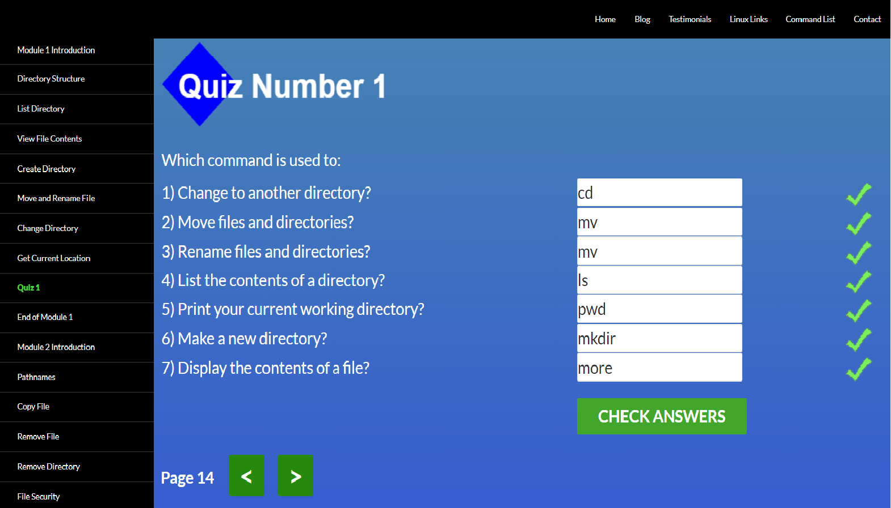
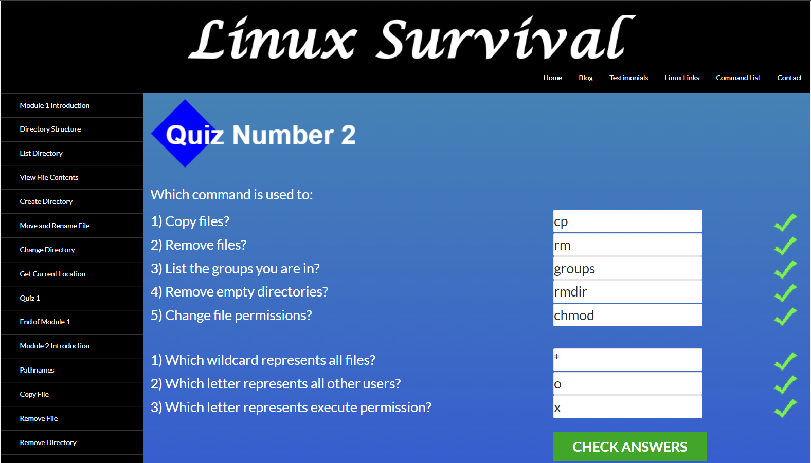
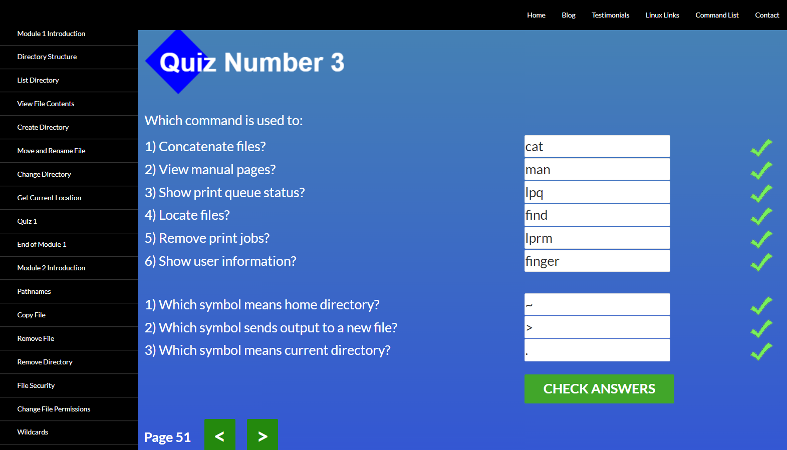
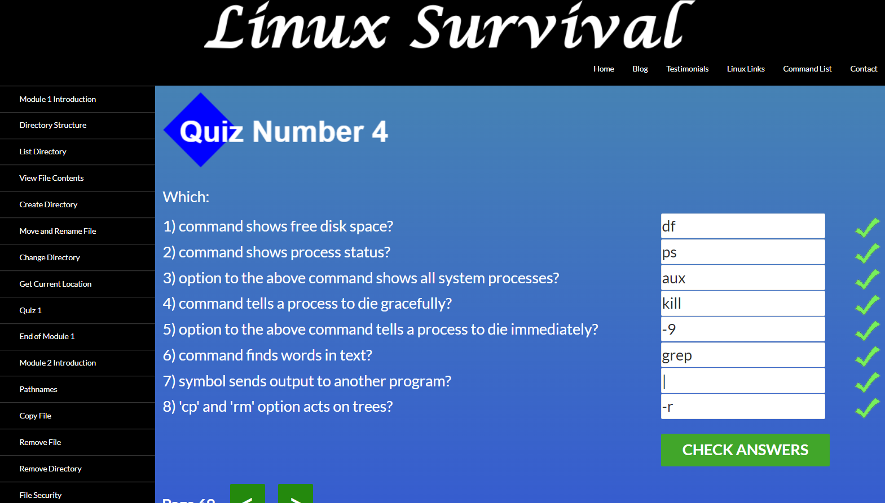
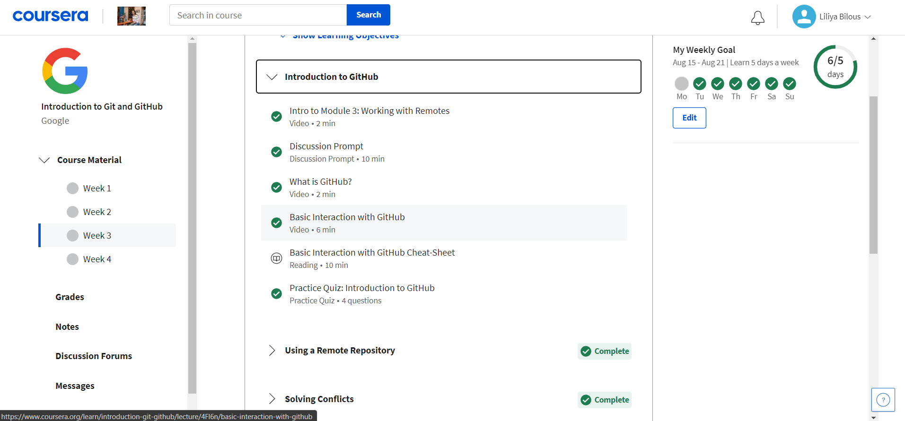
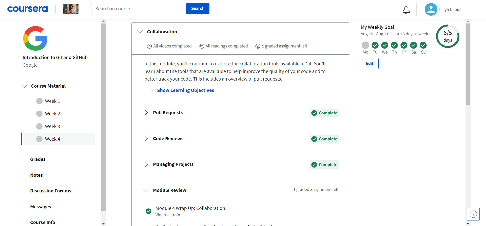

# Front-End Course. Stage 0. Self-Study

## General
### Git Basics
- [X] 1. Прослухайте тижні 1 і 2 курсу Introduction to Git and GitHub

Screenshots

  

 

- [X] 2. Пройдіть рівні тут learngitbranching.js.org

Screenshots

  

 

- [X] 3. З додаткових матеріалів дуже сподобалась стаття "How to Learn and Cope with Negative Thoughts" та навчалка "TypingClub — покращити швидкість набору на клавіатурі"

В принципі з GIT була знайома, але використовувала мабудь лише 10% його можливостей. В основному працювала на GitHub Desktop.
Не знала що в GIT можна редагувати та форматувати текст(Basic writing and formatting syntax) буду використовувати :)

## Linux CLI, and HTTP

- [X] 1. Linux Survival (4 modules)

Screenshots

  
  
  
  
  
  

- [X] 2. HTTP: Протокол, який повинен розуміти кожний веб-розробник - Частина 1

- [X] 3. HTTP: Протокол, який повинен розуміти кожний веб-розробник - Частина 2

З нового в цьому модулі: користування терміналом. Раніше ніколи не користувалась, а виявляється дуже зручна штука.
Здивувало, що можна переглядати/копіювати файли з чужих директорій(звісно якщо відкриті дозволи проте всеодно круто). 
 Планую в майбутньому частіше користуватись терміналом.  
Про HTTP протоколи раніше слухала лекції [Просто Web](https://www.youtube.com/watch?v=ByJl2IcWSfc&list=PLcIcVZ3JhM-gsEmYSzhXy97jV8g5V1O3l) і щиро рекомендую їх для додаткового перегляду, дуже круті!)
  
## Git Collaboration
- [X] 1. Прослухайте тижні 3 і 4 курсу Introduction to Git and GitHub.

Screenshots

  
  
  
  
  

  Новим для мене був Code Reviews та поради як з ним працювати(він же і здивував). Ніколи з ним не зіштовхувалась, але розумію що потрібний і дуже зручний для роботи процес. 
  Планую використовувати Pull Request і вирішення конфліктів. Для PR та Conflict Resolution було багато корисних статей, що планую використовувати в разі потреби.
  
- [X] 2. Пройдіть рівні learngitbranching.js.org.
  

Screenshots

  

## Intro to HTML & CSS

- [ ] 1. Прослухайте тижні 1 і 2 (до Introduction to Responsive Design) курсу [Intro to HTML & CSS](https://www.coursera.org/learn/html-css-javascript-for-web-developers)

- [ ] 2. [Learn HTML(Eng)](https://www.codecademy.com/learn/learn-html)

- [ ] 3. [Learn CSS(Eng)](https://www.codecademy.com/learn/learn-css)

  
#### Додаткові матеріали
- [X] [Лекція по Git від Олексія Руденка](https://www.youtube.com/playlist?list=PLS8sEUxbfFY9MnPIFPTNlaS5xX7P5Ge-5)
- [X] [Git за 30 хвилин](https://codeguida.com/post/453)
- [X] [Git tips](http://sixrevisions.com/web-development/git-tips/) — закріпити свої знання про Git
- [X] [About Merge Conflicts](https://docs.github.com/en/free-pro-team@latest/github/collaborating-with-issues-and-pull-requests/about-merge-conflicts)
- [X] [Resoilving a Merge Conflict](https://docs.github.com/en/free-pro-team@latest/github/collaborating-with-issues-and-pull-requests/resolving-a-merge-conflict-using-the-command-line)
- [X] [Communicating using Markdown](https://lab.github.com/githubtraining/communicating-using-markdown)
- [ ] [Learn anything front-end](https://learn-anything.xyz/web-development/front-end)
- [X] [TypingClub](https://www.typingclub.com/) — покращити швидкість набору на клавіатурі
- [X] [How to Learn and Cope with Negative Thoughts](https://guides.hexlet.io/learning/)

- [X] [How I taught myself to code in eight weeks](http://lifehacker.com/how-i-taught-myself-to-code-in-eight-weeks-511615189)
- [X] [How JavaScript works: Deep dive into WebSockets and HTTP/2 with SSE + how to pick the right path](https://blog.sessionstack.com/how-javascript-works-deep-dive-into-websockets-and-http-2-with-sse-how-to-pick-the-right-path-584e6b8e3bf7)
- [ ] [Command Line Power User](https://commandlinepoweruser.com/)
- [ ] [Configuring Linux Web Servers](https://www.udacity.com/course/configuring-linux-web-servers--ud299)
- [ ] [Networking for Web Developers](https://www.udacity.com/course/networking-for-web-developers--ud256)
- [X] An Introduction to Git and GitHub by Brian Yu (CS50 course), video, ~40 min.
- [X] Oh shit, git!
- [ ] Flight rules for git
- [ ] GitHub Skills
- [ ] [HTML уроки (з 3 по 7 відео)](https://www.youtube.com/watch?v=z3GS5oYGq5U&list=PLM6XATa8CAG4uCli-pMvuvwj46UaQoqIc&index=4)
- [ ] [CSS уроки (з 9 по 15 відео)](https://www.youtube.com/watch?v=z3GS5oYGq5U&list=PLM6XATa8CAG4uCli-pMvuvwj46UaQoqIc&index=4)
- [ ] [Learn HTML(Eng)](https://www.codecademy.com/learn/learn-html)
- [ ] [Learn CSS(Eng)](https://www.codecademy.com/learn/learn-css)
- [ ] [freecodecamp.org](https://www.freecodecamp.org)
- [ ] [Intro to HTML @github](https://lab.github.com/githubtraining/introduction-to-html)
- [ ] [Can't Unsee](https://cantunsee.space/) - brilliant and useful challenge
- [ ] [Publish your static web site using GitHub Pages](https://lab.github.com/githubtraining/github-pages)

