# Front-End Course. Stage 0. Self-Study

# General

## 0.Git Basics

- [x] 1. Прослухайте тижні 1 і 2 курсу Introduction to Git and GitHub

  
Screenshots

  
  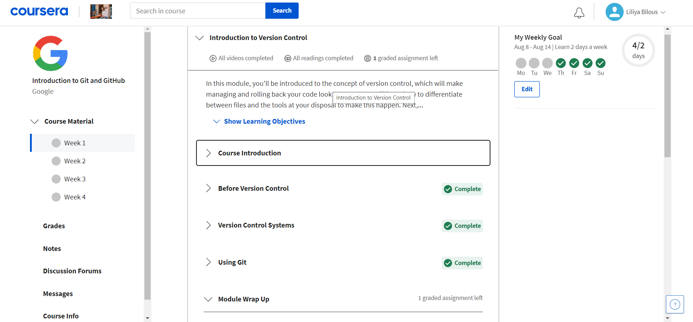
  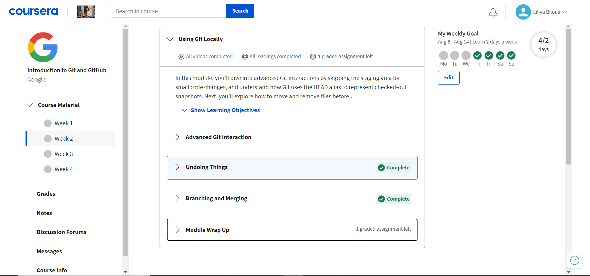

- [x] 2. Пройдіть рівні тут learngitbranching.js.org

  
Screenshots

  
  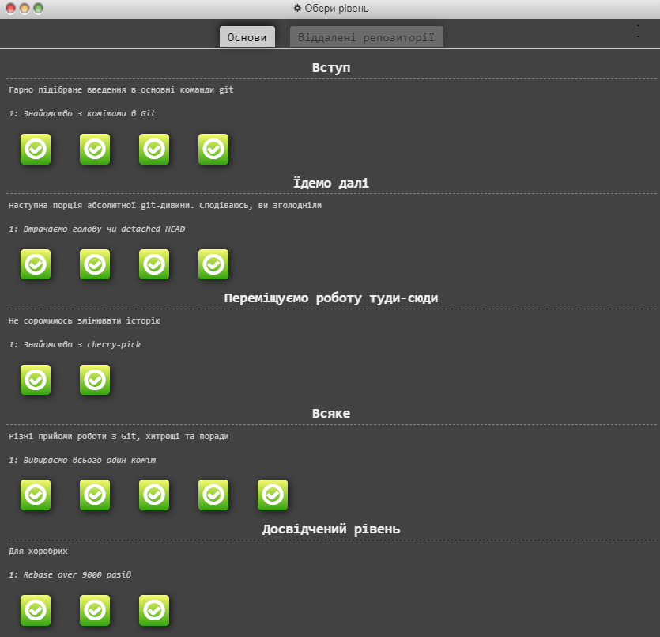
  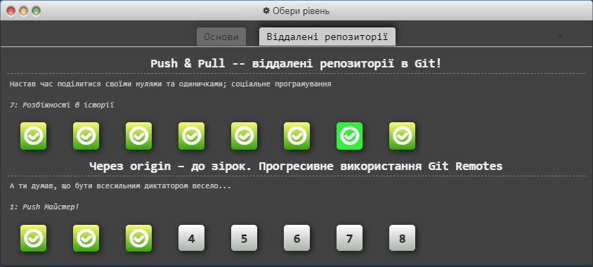

- [x] 3. З додаткових матеріалів дуже сподобалась стаття "How to Learn and Cope with Negative Thoughts" та навчалка "TypingClub — покращити швидкість набору на клавіатурі"

В принципі з GIT була знайома, але використовувала мабудь лише 10% його можливостей. В основному працювала на GitHub Desktop.
Не знала що в GIT можна редагувати та форматувати текст(Basic writing and formatting syntax) буду використовувати :)

## 1.Linux CLI, and HTTP

- [x] 1. Linux Survival (4 modules)

  
Screenshots

  
  
  
  

- [x] 2. HTTP: Протокол, який повинен розуміти кожний веб-розробник - Частина 1

- [x] 3. HTTP: Протокол, який повинен розуміти кожний веб-розробник - Частина 2

З нового в цьому модулі: користування терміналом. Раніше ніколи не користувалась, а виявляється дуже зручна штука.
Здивувало, що можна переглядати/копіювати файли з чужих директорій(звісно якщо відкриті дозволи проте всеодно круто).
 Планую в майбутньому частіше користуватись терміналом.  
Про HTTP протоколи раніше слухала лекції [Просто Web](https://www.youtube.com/watch?v=ByJl2IcWSfc&list=PLcIcVZ3JhM-gsEmYSzhXy97jV8g5V1O3l) і щиро рекомендую їх для додаткового перегляду, дуже круті!)

## 2.Git Collaboration

- [x] 1. Прослухайте тижні 3 і 4 курсу Introduction to Git and GitHub.

  
Screenshots

  
  
  

Новим для мене був Code Reviews та поради як з ним працювати(він же і здивував). Ніколи з ним не зіштовхувалась, але розумію що потрібний і дуже зручний для роботи процес. 
Планую використовувати Pull Request і вирішення конфліктів. Для PR та Conflict Resolution було багато корисних статей, що планую використовувати в разі потреби.

- [x] 2. Пройдіть рівні learngitbranching.js.org.

  
Screenshots

  
  
  

# Front-End Basics

## 3.Intro to HTML & CSS

- [x] 1. Прослухайте тижні 1 і 2 (до Introduction to Responsive Design) курсу [Intro to HTML & CSS](https://www.coursera.org/learn/html-css-javascript-for-web-developers)

  
Screenshots

  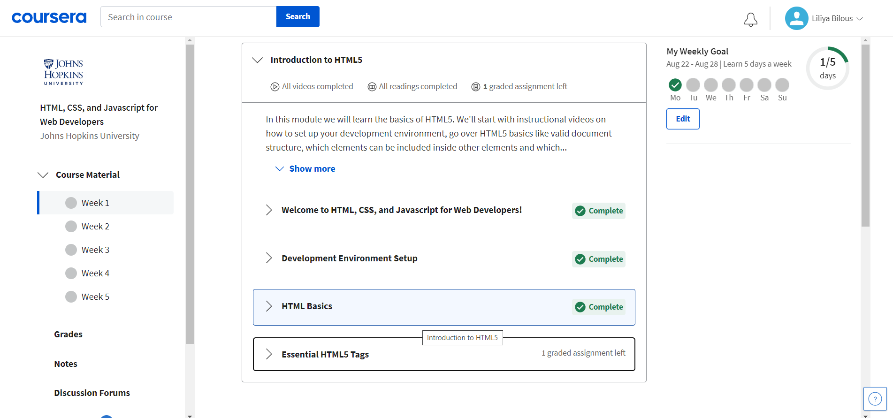
  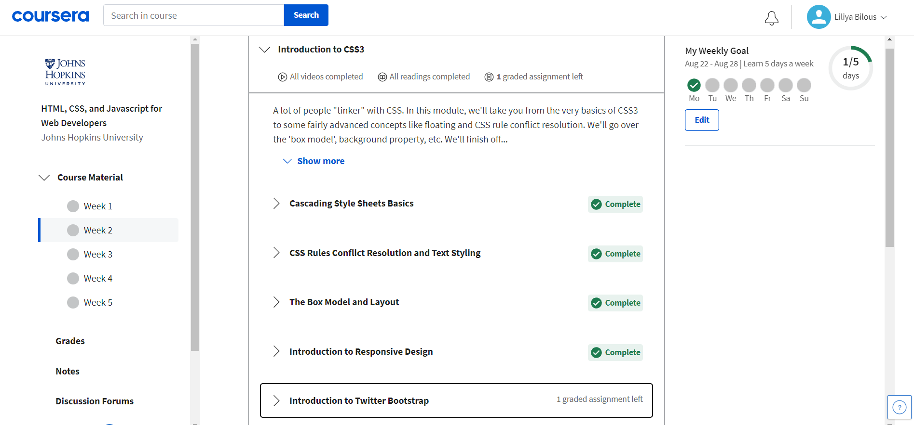

- [x] 2. [Learn HTML(Eng)](https://www.codecademy.com/learn/learn-html)

  
Screenshots

  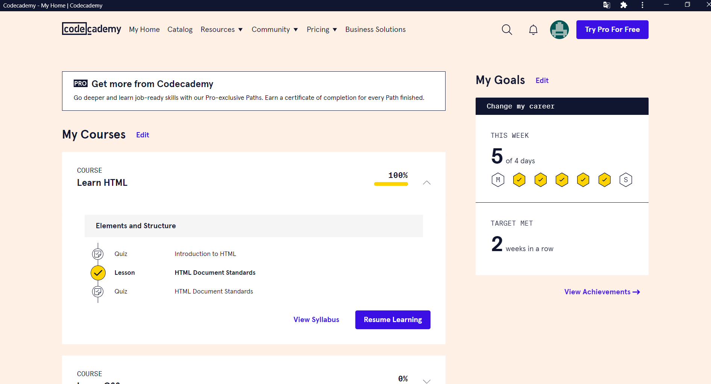

- [x] 3. [Learn CSS(Eng)](https://www.codecademy.com/learn/learn-css)

  
Screenshots

  
  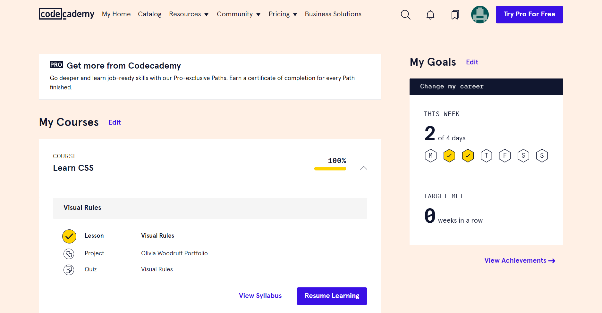

    
Багато часу пішло на опрацювання всіх матеріалів, хоч практично весь матеріал знала раніше.  
З нового в HTML: функція target="blank" в посиланнях.  
З нового у CSS: підключення декількох зображень у background 😱  
Також вперше дізналась про breakpoints в адаптивному дизайні на майбутнє планую вивчити та використовувати адаптив у своїх проектах ☺️

## 4.Адаптивний Web Design

- [x] 1. [Responsive web design basics](https://web.dev/i18n/en/responsive-web-design-basics/)

- [x] 2. [FLEXBOX. Вчимося верстати на флексах](https://www.youtube.com/playlist?list=PLM6XATa8CAG5mPV60dMmjMRrHVW4LmV2x)

- [x] 3. [Flexbox Froggy](http://flexboxfroggy.com/) - гра для закріплення

  
Screenshots

  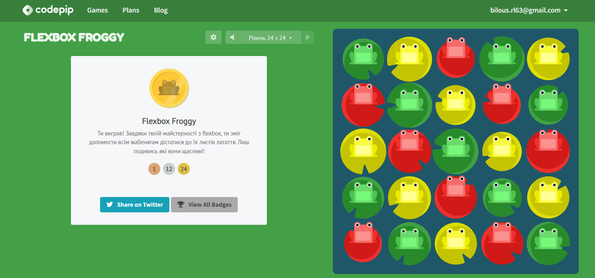

- [x] 4. [CSS Grid Layout](https://www.youtube.com/watch?v=GV92IdMGFfA&list=PLM6XATa8CAG5pXQrW_kDaeZb_uIAMNZIm)

- [x] 5. [Grid Garden](http://cssgridgarden.com/) - гра для закріплення

  
Screenshots

  
  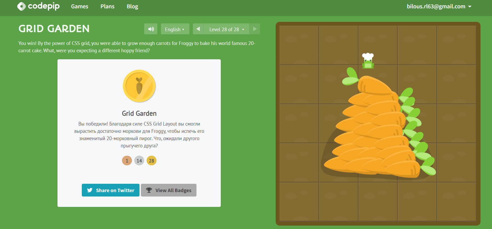

Якщо з Flexbox раніше я була знайома і з ним проблем нби не виникало, а то Grid були для мене мало доступні. Зараз завдяки курсам [CSS Grid Layout](https://www.youtube.com/watch?v=GV92IdMGFfA&list=PLM6XATa8CAG5pXQrW_kDaeZb_uIAMNZIm) все стало набагато зрозуміліше.
До котанів як раз зупинилась з вивченням CSS на грідах, сподіваюсь тепер я як раз зможу закрити макет по Флексам/Грідам....ну і мене чекає Hooli-style Popup

## 5.HTML і CSS практика: Hooli-style Popup

[Demo](https://liliabilous.github.io/popup-practice/) |
[Code](https://github.com/LiliaBilous/popup-practice)

## 6.JavaScript Basics

- [x] 1. [Вступ до JS](https://www.coursera.org/learn/html-css-javascript-for-web-developers/home/week/4)

  
Screenshots

  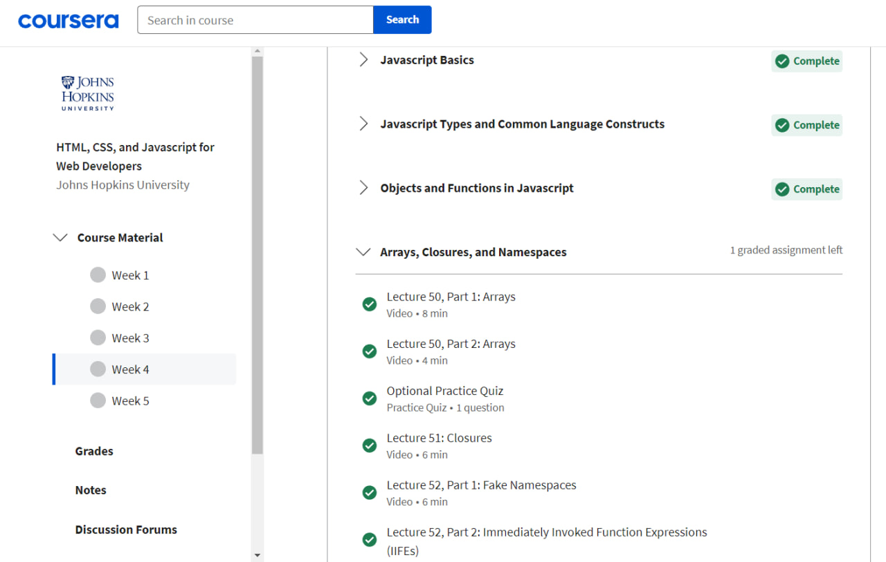

2. Вправи FreeCodeCamp.
 - [X] Basic JavaScript 
 - [X] ES6 Challenges. Виконайте початкові 17 вправ.
 - [X] Basic Data Structures
 - [X] Basic Algorithm Scripting
 - [X] Functional Programming
 - [X] Algorithm Scripting Challenges. Розв’яжіть початкові 11 задач.
 

  
Screenshots

   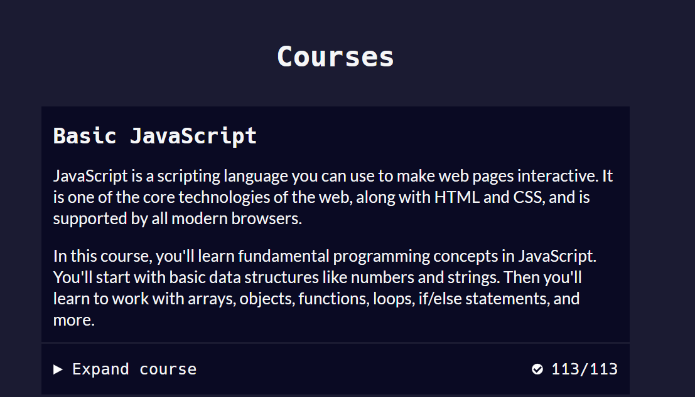
   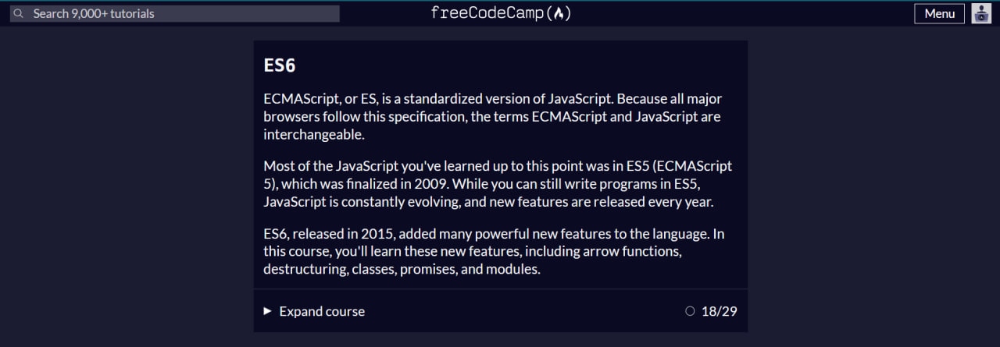
   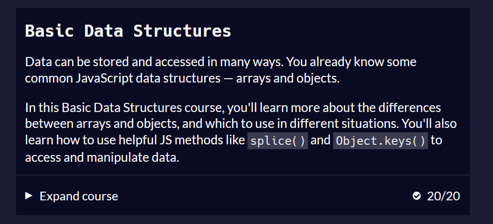
   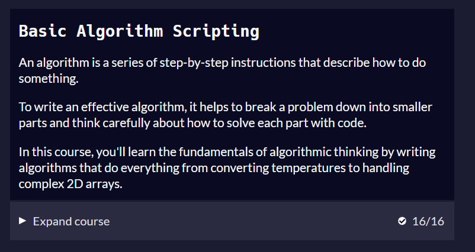
   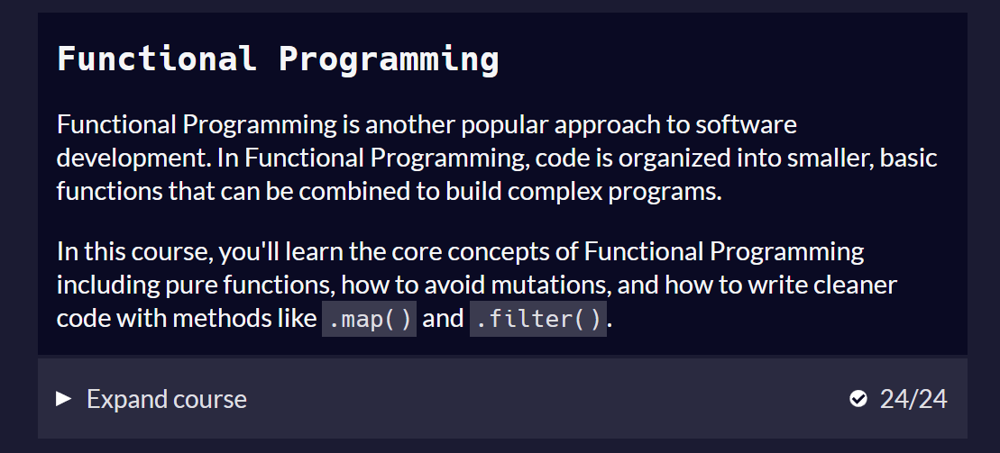
   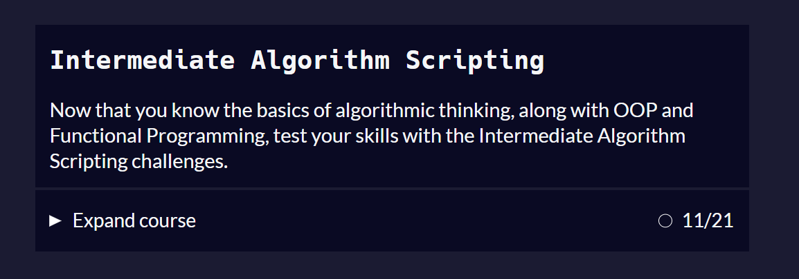
 

Я не була знайома ні з JavaScript ні з будь якою іншою мовою програмування раніше тож новим було все)))
Для мене не достатньо було матеріалу з курсу Coursera та й на FreeCodeCamp не завжди все зрозуміло з першого разу, тож додатково для себе:

 - пройшла курс на CodeCademy;
 - багато чого читала/вивчала теорії з сайтів javascript.info та developer.mozilla.org;
 - пройшла повний курс з JavaScript на FreeCodeCamp (як на мене дуже крутий курс і класна можливість отримати безкоштовний сертифікат);
 - та для практики розвязувала задачі на codewars.com.
   
І нехай я доволі багато часу відвела саме на цей модуль та JavaScript в цілому, щодня я все ще вивчаю щось нове з JS і це круто!)

Тож...

+ що було новим: практично все оскільки починала навчання практично з нуля;

+ що здивувало: мабудь Passing by Value & Passing by Reference - принаймні найбільше запамяталось;

+ що буду використовувати в майбутньому: синтаксис ES6 особливо стрілкові функції(краса і лаконічність - 2 в 1) та продовжувати поглиблювати знання з JS.

## 7.Document Object Model - practice
Дізнайтеся деякі frontend основи про DOM API:
- [X] 1. Прослухайте тільки розділ [Document Object Model Manipulation](https://www.coursera.org/learn/html-css-javascript-for-web-developers/home/week/5)

  
Screenshots

  
  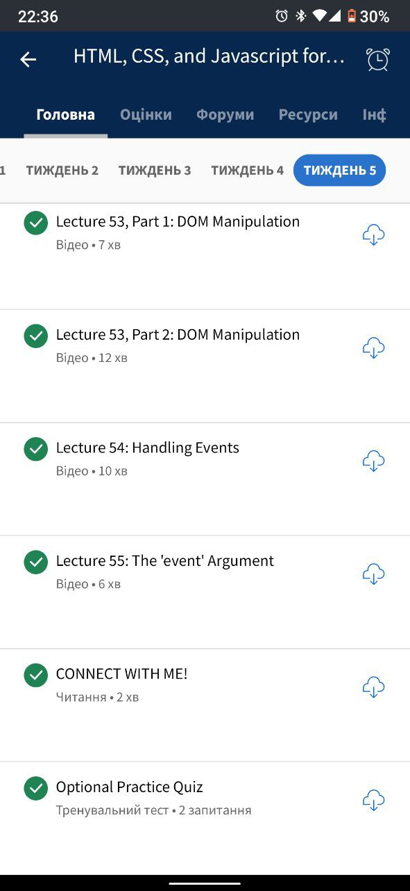

- [ ] 2. Freecodecamp Algorithm Scripting Challenges.
закінчити завдання 12..18 (Sum All Odd Fibonacci Numbers до Everything Be True).

  
Screenshots

- [ ] 3.then() Практичне завдання:

[Demo]( ) |
[Code]( )

# Advanced Topics
#### Додаткові матеріали

- [x] [Лекція по Git від Олексія Руденка](https://www.youtube.com/playlist?list=PLS8sEUxbfFY9MnPIFPTNlaS5xX7P5Ge-5)
- [x] [Git за 30 хвилин](https://codeguida.com/post/453)
- [x] [Git tips](http://sixrevisions.com/web-development/git-tips/) — закріпити свої знання про Git
- [x] [About Merge Conflicts](https://docs.github.com/en/free-pro-team@latest/github/collaborating-with-issues-and-pull-requests/about-merge-conflicts)
- [x] [Resoilving a Merge Conflict](https://docs.github.com/en/free-pro-team@latest/github/collaborating-with-issues-and-pull-requests/resolving-a-merge-conflict-using-the-command-line)
- [x] [Communicating using Markdown](https://lab.github.com/githubtraining/communicating-using-markdown)
- [x] [Learn anything front-end](https://learn-anything.xyz/web-development/front-end)
- [x] [TypingClub](https://www.typingclub.com/) — покращити швидкість набору на клавіатурі 👍
- [x] [How to Learn and Cope with Negative Thoughts](https://guides.hexlet.io/learning/)
- [x] [How I taught myself to code in eight weeks](http://lifehacker.com/how-i-taught-myself-to-code-in-eight-weeks-511615189)
- [x] [How JavaScript works: Deep dive into WebSockets and HTTP/2 with SSE + how to pick the right path](https://blog.sessionstack.com/how-javascript-works-deep-dive-into-websockets-and-http-2-with-sse-how-to-pick-the-right-path-584e6b8e3bf7)
- [ ] [Command Line Power User](https://commandlinepoweruser.com/)
- [ ] [Configuring Linux Web Servers](https://www.udacity.com/course/configuring-linux-web-servers--ud299)
- [ ] [Networking for Web Developers](https://www.udacity.com/course/networking-for-web-developers--ud256)
- [x] [An Introduction to Git and GitHub by Brian Yu (CS50 course), video, ~40 min.](https://youtu.be/MJUJ4wbFm_A)
- [x] [Oh shit, git!](http://ohshitgit.com/)
- [x] [Flight rules for git](https://github.com/k88hudson/git-flight-rules)
- [x] [GitHub Skills](https://skills.github.com/)
- [x] [HTML уроки (з 3 по 7 відео)](https://www.youtube.com/watch?v=z3GS5oYGq5U&list=PLM6XATa8CAG4uCli-pMvuvwj46UaQoqIc&index=4)
- [x] [CSS уроки (з 9 по 15 відео)](https://www.youtube.com/watch?v=z3GS5oYGq5U&list=PLM6XATa8CAG4uCli-pMvuvwj46UaQoqIc&index=4)
- [x] [freecodecamp.org](https://www.freecodecamp.org)
- [x] [Intro to HTML @github](https://lab.github.com/githubtraining/introduction-to-html)
- [x] [Can't Unsee](https://cantunsee.space/) - brilliant and useful challenge 👍
- [x] [Publish your static web site using GitHub Pages](https://lab.github.com/githubtraining/github-pages)
- [ ] [Specificity](https://developer.mozilla.org/uk/docs/Web/CSS/Specificity)
- [ ] [Specificity calculator](https://specificity.keegan.st/)
- [ ] [11 things I learned reading the flexbox spec](https://medium.com/hackernoon/11-things-i-learned-reading-the-flexbox-spec-5f0c799c776b)
- [x] [Flexbox Zombies](https://flexboxzombies.com/p/flexbox-zombies) (прикольна гра 👍)
- [ ] [HiDPI Screens and Web Development](https://tech.cars.com/hidpi-screens-and-web-development-72eb9b07ce7)
- [x] [FunFunFunction - Functional programming in JavaScript](https://www.youtube.com/playlist?list=PL0zVEGEvSaeEd9hlmCXrk5yUyqUag-n84) 👍
- [ ] [Algorithms Course by Khan Academy](https://www.khanacademy.org/computing/computer-science/algorithms)
- [ ] [Visualization of Common Algorithms and Data Structures](https://www.cs.usfca.edu/~galles/visualization/Algorithms.html)
- [ ] [JavaScript Algorithms and Data Structures examples](https://github.com/trekhleb/javascript-algorithms)
- [ ] [You Don't Know JS Yet: Get Started - 2nd Edition](https://github.com/getify/You-Dont-Know-JS/tree/2nd-ed/get-started)
- [ ] [JavaScript Equality Table Game](https://eqeq.js.org/)
- [ ] [JavaScript-Equality-Table](https://dorey.github.io/JavaScript-Equality-Table/)
